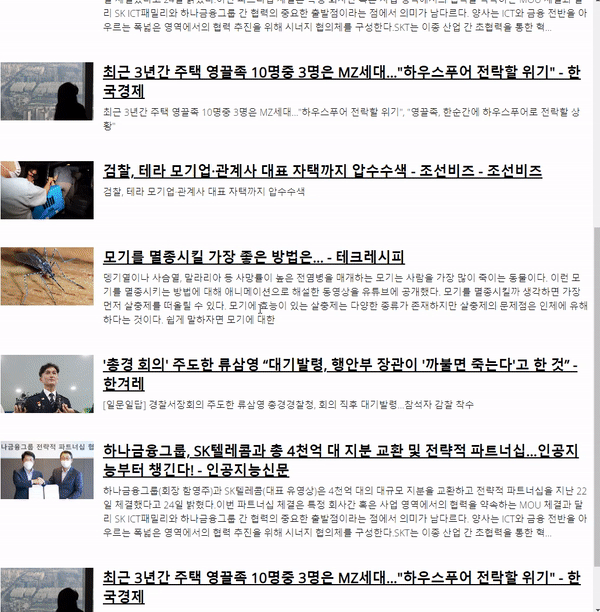
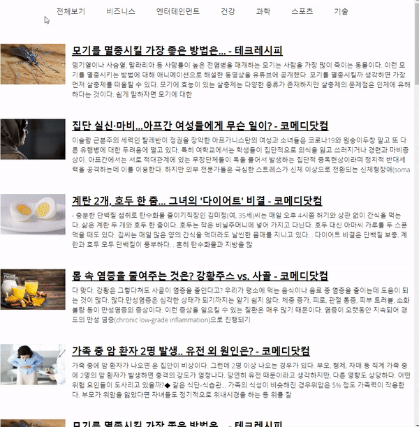

# 📡 News Viewer

## 💁‍♂️ Introducing Project

> -   무한 스크롤을 지원하는 News Viewer 를 구현한 결과물 입니다.
> -   스크롤을 아래로 내리면 5개의 기사를 가져오게됩니다.
> -   카테고리를 구분하여 데이터를 가져올 수 있습니다.

## 📅 Date / Developer

> -   2022.04. 1 ~ 2022. 04 15(2주)
> -   1인 프로젝트

## 📌 Point

> -   Infinite Scroll
> -   Component

## 🛠 Using Skill

> -   HTML5
> -   CSS3
> -   Vanilla Javascript
> -   Axios
> -   Intersection Observer
> -   Eslintrc

## 🌐 News API

> -   [News API](https://newsapi.org/)

## 🔔 Alarm

> -   본 프로젝트는 무로 apikey를 사용하였습니다.
> -   News API 정책 변경으로 무료 apikey는 localhost에서만 작동합니다.

## 📁 Folder Structure

```
├─components
│  ├─App.js : new view 코어 부분
│  ├─api.js : axios를 이용하여 데이터 요청
│  ├─index.js : root 클래스 선택하여 news App 화면에 렌더링
│  ├─Nav.js : 상단 네비게이션 바 생성
│  └─NewsList.js  : 썸네일 이미지, 뉴스 링크, 타이틀 등 뉴스 아이템
└─index.html

```

## 🔧 How To Use?

#### start

```
npm install
```

## 👓 Screen

<p>스크롤 내릴때마다 5개씩 새로운 뉴스 가져오기!</p>
<center>
  
</center>

<p>카테고리별 새로운 뉴스 가져오기!</p>
<center>
  
</center>

<p>뉴스 아이템을 클릭하면 뉴스 링크로 이동!</p>
<center>
  
</center>
